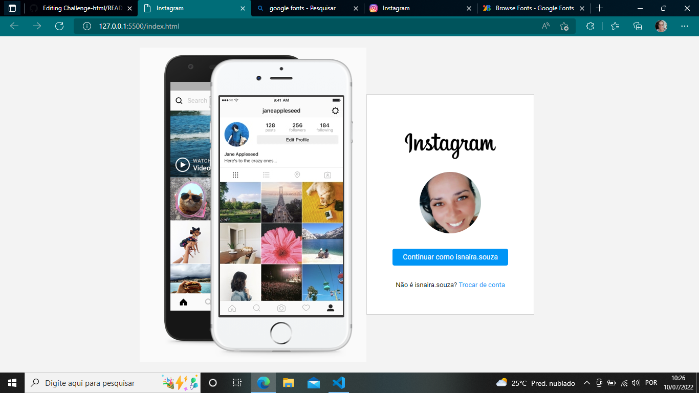

# RECREATING-PAGE-INSTAGRAM
 
Project created in dio bootcamp class.

  

> Project created in the class "Recreating the Instagram homepage". HTML and CSS technologies were used. Simple but interesting project to remember the technologies involved.

## 🤝👩🏻 Collaborator

<table>
  <tr>
    <td align="center">
      <a href="#">
         
        
          <b>Isnaíra Souza</b>
        
      </a>
    </td>
    
</table>
